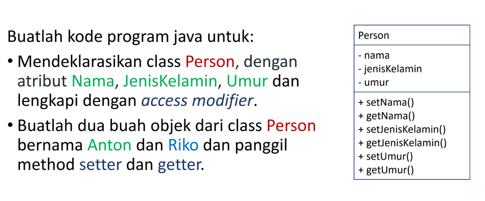
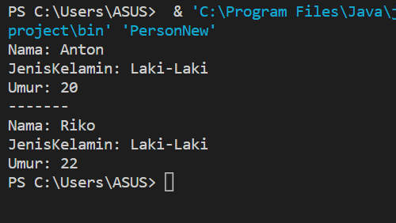

# Praktikum-2
<p><b> Nama    :   Viena Dwi Putri Maulina </p>
<p><b> NIM     :   312110469 </p>
<p><b> Kelas   :   TI.21.C1 </p>
<p><b> Mata Kuliah : Pemrograman Orientasi Objek</p>
<p><b> Tugas Pertemuan 5 </p>
<br>
<p> Berikut soal latihan 1 <p>



<p>berikut script java <p>
<p>Person.java<p>

```java
public class Person {
    private String Nama;
    private String JenisKelamin;
    private int Umur;

    //setter
    public void setNama(String Nama){
        this.Nama = Nama;
    }
    public void setJenisKelamin(String JenisKelamin){
        this.JenisKelamin = JenisKelamin;
    }
    public void setUmur(int Umur){
        this.Umur = Umur;
    }

    //getter
    public String getNama(){
        return this.Nama;
    }
    public String getJenisKelamin(){
        return this.JenisKelamin;
    }
    public int getUmur(){
        return this.Umur;
    }
}
```

<p> berikut script java untuk PersonNew.java<p>

```java

public class PersonNew {
    public static void main(String[] args) {
    //Membuat objek
    Person a = new Person();

    //memanggil atribut dan memberi nilai
    a.setNama("Anton");
    a.setJenisKelamin("Laki-Laki");
    a.setUmur(20);
    System.out.println("Nama: "+a.getNama());
    System.out.println("JenisKelamin: "+a.getJenisKelamin());
    System.out.println("Umur: "+a.getUmur());

    System.out.println("-------");

    Person b = new Person();
    b.setNama("Riko");
    b.setJenisKelamin("Laki-Laki");
    b.setUmur(22);
    System.out.println("Nama: "+b.getNama());
    System.out.println("JenisKelamin: "+b.getJenisKelamin());
    System.out.println("Umur: "+b.getUmur());
    }
}
```
<p> berikut hasil output <p>


